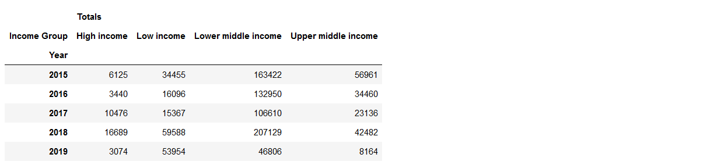
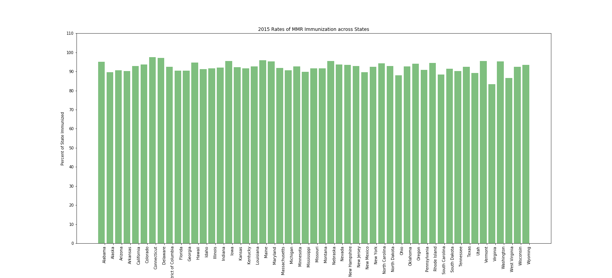

# Measles Outbreaks & Vaccination Rates In The United States & Around The World

With the current uptick in Measles outbreaks in the world, my team and I decided to look at the measles cases around the world and how the United States compares to the rest of the world.

Here we looked at several data sets including World Bank, the World Health Organization, the US Center for Disease Control and Prevention. Using the seperate data sets, my team and I merged some of these data sets together to answer the questions we asked.

## Around The World

### Reported Measles Cases By Country Wealth Classification (2015 - 2019)

Here is a bar graph comparing the number of measles outbreaks over the years for different countries included in their respective wealth classification. And the table is also included to show the data in numbers.

###### Stacked Bar Graph - Measles Cases By Country Wealth Classification (2015 - 2019)

###### Table - Measles Cases By Country Wealth Classification (2015 - 2019)

## In The United States

### Reported Measles Cases In The United States

###### Line Graph - Measels Outbreaks (2011 - 2015)

###### Line Graph - Measels Outbreaks (2019)

###### Line Graph - Imported Measels Cases (2019)

###### Line Graph - Indigenous Measels Cases (2019)

### MMR Vaccination Rates In The United States

###### Line Graph - Immunization Rates (2010 - 2017)

###### Bar Graph - Immunization Rates By States (2014)

###### Bar Graph - Immunization Rates By States (2015)

###### Bar Graph - Immunization Rates By States (2016)

### States With Vaccination Exemptions

###### Bar Graph - Immunization Rates By States (2016)

