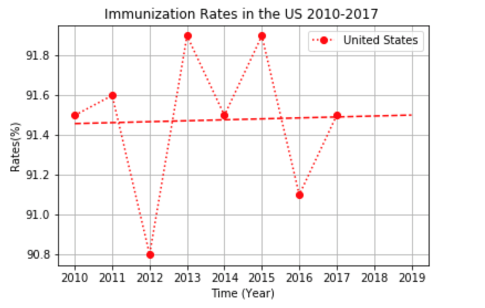

# Measles Outbreaks & Vaccination Rates In The United States & Around The World

## Background

With the current uptick in Measles outbreaks in the United States and around the world, my team and I decided to look at data related to the measles cases in the United States and the world from 2015 to 2019. Since the MMR vaccine is the best defense against the measles, we also looked at the vaccination rates here in the United States for the years 2010 to 2017.

My team and I wanted to show that there has been a rise in vaccination increases in the United States as measles cases are increasing not just here in the United States but also the rest of the world. In our analysis we looked at measles cases for lower income, lower middle income, upper middle income and upper income countries from the years 2015 to 2019. From here we looked at how the United States compares to the rest of the world by looking at the measles cases in the United States in the same time period. Also we also obtained publicly available information on the vaccination rates here in the United States and trying to break the information down by each individual states. Since we have noticed that some states do have higher vaccination rates than others, we also looked at the different exemptions that some states have.

Here we looked at several data sets including World Bank, the World Health Organization, the US Center for Disease Control and Prevention. Using the seperate data sets, my team and I merged some of these data sets together to answer the questions we asked.

## Hypothesis
When starting our project, my team and I hypothesized that the vaccination rates here in the United States has increased as the number of measles cases has increased here in the United States and the rest of the world.

## Data Sets
My team and I collected a plethora of data from various global organizations and US sources. Some of these data sources include but not limited to:
* World Health Organization
* World Bank
* US Department of Health & Human Services Centers for Disease Control & Prevention

## Conclusion & Findings

## Around The World

### Reported Measles Cases By Country Wealth Classification (2015 - 2019)

Here is a bar graph comparing the number of measles outbreaks over the years for different countries included in their respective wealth classification. And the table is also included to show the data in numbers.

###### Stacked Bar Graph - Measles Cases By Country Wealth Classification (2015 - 2019)

###### Table - Measles Cases By Country Wealth Classification (2015 - 2019)

## In The United States

### Reported Measles Cases In The United States

###### Line Graph - Measels Outbreaks (2011 - 2015)

###### Line Graph - Measels Outbreaks (2019)

###### Line Graph - Imported Measels Cases (2019)

###### Line Graph - Indigenous Measels Cases (2019)

### MMR Vaccination Rates In The United States

###### Line Graph - Immunization Rates (2010 - 2017)

###### Bar Graph - Immunization Rates By States (2014)

###### Bar Graph - Immunization Rates By States (2015)

###### Bar Graph - Immunization Rates By States (2016)

### States With Vaccination Exemptions

###### Bar Graph - Immunization Rates By States (2016)

